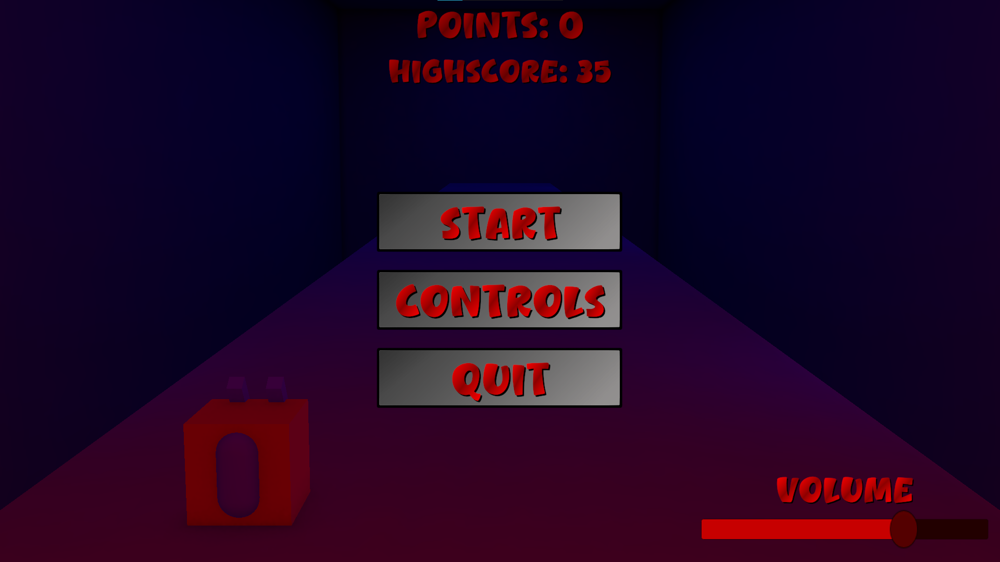
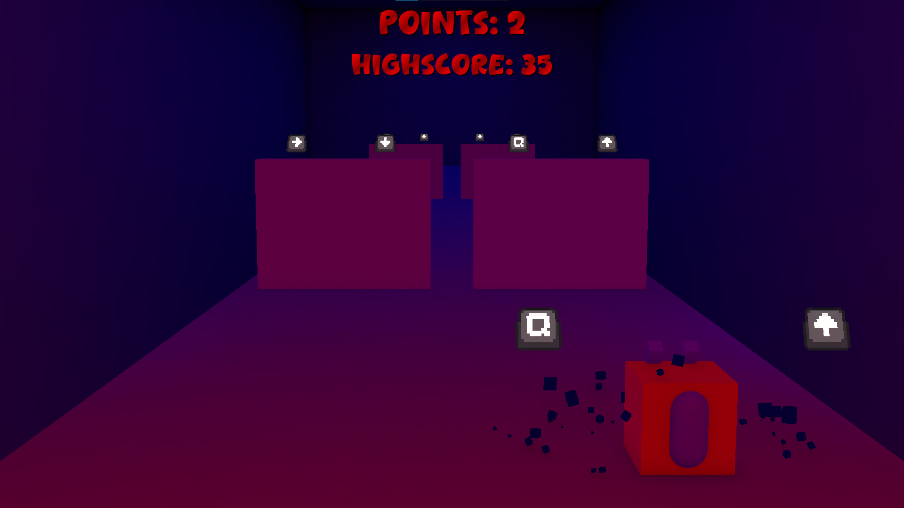
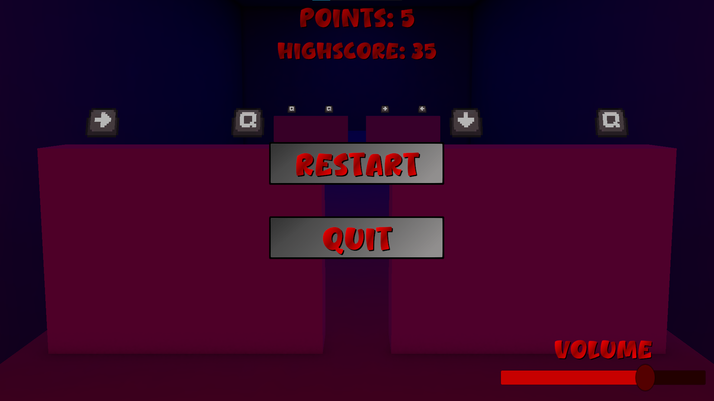
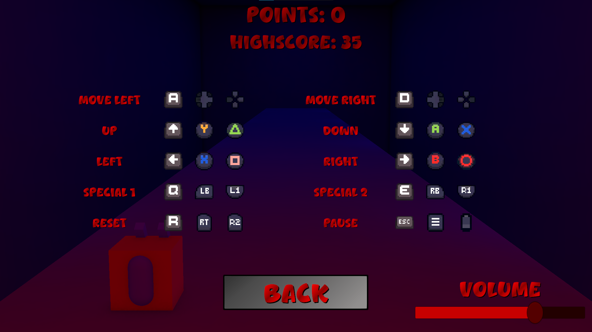

 
  

<h1 align="center"> Dodge Them All </h1>

<h2>About The Project</h2>

 
  This project is a small game focused on dodging or, to be more specific, destroying the obstacles coming your way with the correct combination of buttons. It was mainly created as a way to try combining two methods of controls using Unity Input System.

<h2>Instalation</h2>

<h3>Unity Project</h3>

- Clone the repository into your local machine
- Install the required Unity version
- Open the project

<h3>Release</h3>

- Download the release version
- Unpack the zip archive
- Launch the executable

<h2>Usage</h2>

- When the game is launched, players start in the main menu
- They can check out different controls for each of the available controllers
- After that, they can start the game

<h2>Gameplay Screenshots</h2>

  

  

  

  

